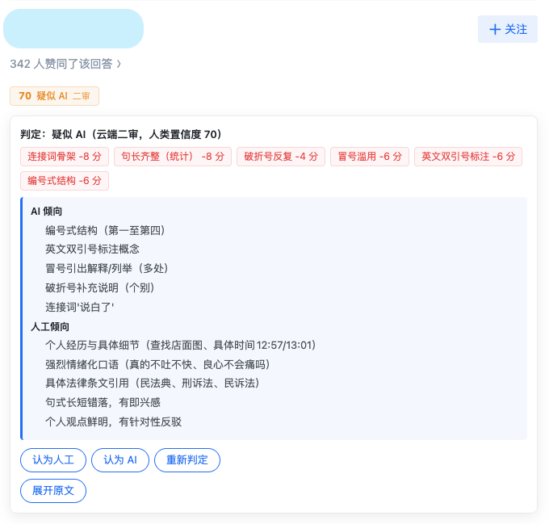

# 知乎照妖镜

在知乎问题页为每条回答打上「人类置信度」角标（0–100，100 = 几乎确定人工），一眼识别疑似 AI 生成的内容。默认**纯本地校准打分引擎**即时判定、零构建零依赖；拿不准的回答可选接入**你自己配置的 LLM** 做云端复核；判错了还能**一键覆盖**。与黑盒检测服务不同——每条判定都附逐特征的贡献清单，理由可查、结果可改、数据只留在本机。

## 亮点

- **纯本地优先**：默认只跑校准打分引擎——21 类写作特征（套话连接词、编号式结构、标点分布、英文双引号标注等）的命中数 + 4 统计文本特征（句长波动/标点密度/平均句长/逗号占比）经逻辑回归权重校准（权重由 C-ReD 知乎问答语料 + deepseek-v4-flash 平衡拟合，替代手拍扣分），输出 0–100 人类置信度，不发送任何内容
- **可解释**：点角标展开理由面板，逐特征列出对数几率贡献（正 = 偏向人类，负 = 偏向 AI）；二审还分「AI 倾向 / 人工倾向」两组证据，不是一句黑盒结论
- **可覆盖**：判定不满意一键「认为人工 / 认为 AI」，按回答 ID 持久化，刷新页面仍生效；优先级 **用户覆盖 > 云端二审 > 引擎判定**
- **作者控制**：固定屏蔽某个作者（整卡占位、不做任何检测）或始终信任某个作者（一轮不跑、仅灰色小签），以主页 `zhihu.com/people/xxx` 为身份，作者级规则优先于一切判定；屏蔽/信任后全页该作者全部卡片即时生效，跨页面持久化
- **文章支持**：文章详情页（`/p/xxx`，含知乎专栏）与首页/问题页的文章卡片同样判定——万字长文默认「头尾各半」抽样（各 2000 字，覆盖结尾套话）；AI 文章仅角标提示、不藏正文；文章与回答的阈值共享、设置与预算独立
- **隐私可控**：API Key 只存在本机 `chrome.storage.local`，不同步不上传；正文仅在「启用二审 + 配置 Key + 分数落入模糊带 10–55」时才发送给你指定的服务商
- **轻量**：零构建零依赖，生产包约 66 KB；Manifest V3（Chrome ≥ 109），11 个经典脚本，无第三方依赖
- **可定制**：阈值（默认 确定≤30 / 疑似≤50）、模糊带（默认 10–55）、字数下限（回答默认 300 字、文章默认 800 字，更短跳过）、输入窗口、自定义正则规则（增删改）、二审提示词（`{{ai_slot_ctx}}` 保留字拼一审上下文）全部可在设置页调整

## 效果一览

| 正常判定 | 确定 AI | 短回答跳过 |
|---|---|---|
|  |  |  |

疑似 AI 回答：理由面板展开（命中痕迹扣分 + AI/人工倾向证据 + 覆盖/重新判定操作）：



设置页（阈值 / 模糊带 / API / 二审权重 / 提示词编辑 / 自定义规则）：


## 安装

1. 打开 `chrome://extensions`，右上角开启「开发者模式」
2. 点「加载已解压的扩展程序」，选择本目录（或解压 `dist/zhihu-zyj-0.1.0.zip` 后选择解压目录）
3. 打开任意知乎问题页（`zhihu.com/question/*`）即生效

> 扩展更新（重新加载）后，已打开的知乎页面里的旧内容脚本会失效（按钮无响应属正常），**刷新页面即可**。

## 快速使用

1. 每条回答上方自动出现角标（红 = 确定 AI / 橙 = 疑似 AI / 绿 = 正常 / 灰 = 跳过）
2. 点击角标展开理由面板：命中痕迹清单 + 二审证据 + 「认为人工 / 认为 AI / 重新判定」按钮
3. （可选）面板底部「屏蔽该作者 / 信任该作者」：屏蔽后该作者全部回答整卡占位（可 [查看] 临时展开、[取消屏蔽] 恢复）；信任后零检测、仅灰色小签「已信任」（点击可取消信任 / 改为屏蔽）
4. （可选）点击工具栏图标打开设置页：填入 API Key（OpenAI 兼容，默认 DeepSeek）并保存——首次保存会请求授权该 API 域名，授权后模糊判定的回答启用云端复核；「作者管理」卡片可按主页链接批量添加/移除屏蔽或信任作者；「文章设置」组可调文章抽样方式与字数上下限
5. 文章（`zhuanlan.zhihu.com/p/*` 等）打开即判：角标在标题/作者区旁，点击展开与回答相同的理由面板；AI 文章只提示不隐藏正文

## 工作原理

1. **发现**：`MutationObserver` 捕捉已渲染与滚动加载的回答卡片
2. **提取**：只取块级正文段落（默认 ≤2000 字，图/引用/图片占位跳过；连续两次采样一致才判定，避免 SPA 半渲染态干扰缓存哈希）
3. **初审（校准打分）**：21 类特征命中数 × 学习权重 → sigmoid → 0–100 人类置信度 + 逐特征贡献清单；默认阈值 确定≤30 / 疑似≤50
4. **二审**（可选）：分数落入模糊带 10–55 时调用你配置的 LLM，按正文哈希缓存（LRU 500 条）、每页限 20 次、失败自动降级为一审分；二审分与一审分按权重（默认 0.6）融合，降低 LLM 打分波动

## 目录结构

```
manifest.json                  MV3 清单（权限/内容脚本/选项页）
src/
  shared/constants.js          默认配置 / 存储键 / 消息类型 / 二审提示词
  shared/storage.js            设置（含版本化迁移）、覆盖、作者规则、二审缓存的存储助手
  engine/traces.js             AI 写作特征清单（21 类，命中计数）
  engine/calibrated-weights.js 校准权重常量（C-ReD 知乎问答 + flash 平衡拟合 + 统计特征，v4）
  engine/stat-features.js      统计文本特征提取（句长波动/标点密度/平均句长/逗号占比，票 10）
  engine/rules.js              校准打分引擎（sigmoid 评分 + 统计特征 + 等级映射 + 回退开关）
  content/extract.js           知乎 DOM 选择器与正文/文章提取（单点维护）
  content/content.js           内容脚本主逻辑
  content/content.css          角标样式（zys- 前缀）
  cloud/second-opinion.js      云端二审（缓存/限流/调用/融合）
  background/service-worker.js SW：二审路由
  options/                     设置页（SPA，零构建）
icons/                         16/48/128 图标
docs/images/                   README 截图
```

## 限制

- 支持知乎问题页（`zhihu.com/question/*`）、首页时间线（`zhihu.com/` 推荐流中的回答与文章卡片）与文章详情页（`zhihu.com/p/*`、`zhuanlan.zhihu.com/p/*`）；首页折叠预览仅摘要时标记"跳过"，展开全文后自动重新判定
- 文章默认「头尾各半」抽样（上限 4000 字 = 头尾各 2000）；AI 文章仅角标提示，不隐藏正文
- 作者规则只对**可识别作者**生效：匿名回答与首页折叠预览卡（无作者主页链接）不参与屏蔽/信任，展开后自动适用
- 自定义 API 域名需为 https，保存时动态申请权限（拒绝则二审不可用）
- 校准打分基于 C-ReD 知乎问答语料的域内分布：文学性/古风文本已被数据正确放行（《滕王阁序》实测 54 正常），但**学术/公文式行文**（首先/其次/综上所述 枚举 + 总结收尾）可能误判为 AI——这是校准权重的已知误报类，可调阈值、二审复核或手动覆盖；扩展更新后旧存档阈值自动迁移（仅当未自定义时）
- **v4（统计特征）已知限制**：短文本（<300 字，回答字数下限以下不评分）统计特征不稳；人类正常率约 83%（增量误报入疑似区由二审 [10,55] 兜底）。flash 漏判仍约 21%

## 开发

零构建项目：新增/修改 `src/` 下的脚本后，在 `chrome://extensions` 点刷新即可；`node --check` 可做语法校验。生产包 = `zip -r dist/zhihu-zyj-<版本>.zip manifest.json src icons`（`dist/` 已被 gitignore）。

- 领域词汇：`CONTEXT.md`
- 架构决策：`docs/adr/`（两级引擎、分数融合等）
- MVP / P2 规格与实现 ticket：`.scratch/mvp/`、`.scratch/p2/`
- 商店上架资料：`CHROMEWEBSTORE.md`

## Credits

内置的 21 类 AI 创作痕迹规则（套话连接词、编号式结构、冒号/破折号滥用、英文双引号标注等）在信号分类与判定思路上借鉴了 [stop-slop-zh](https://github.com/pencil20388-eng/stop-slop-zh)（中文版 Stop Slop，灵感源自 [hardikpandya/stop-slop](https://github.com/hardikpandya/stop-slop)）；本地参考副本见 `stop-slop-zh/`（MIT License，仅作规则设计参考，不入库）。
