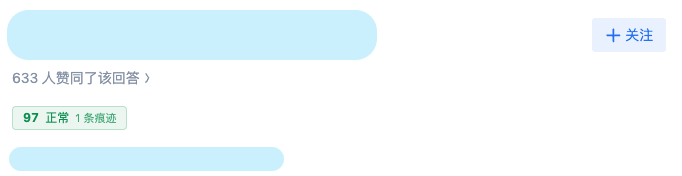
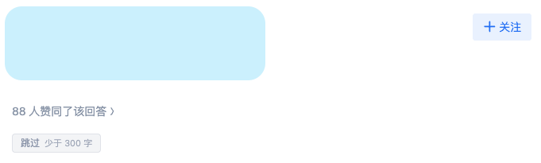
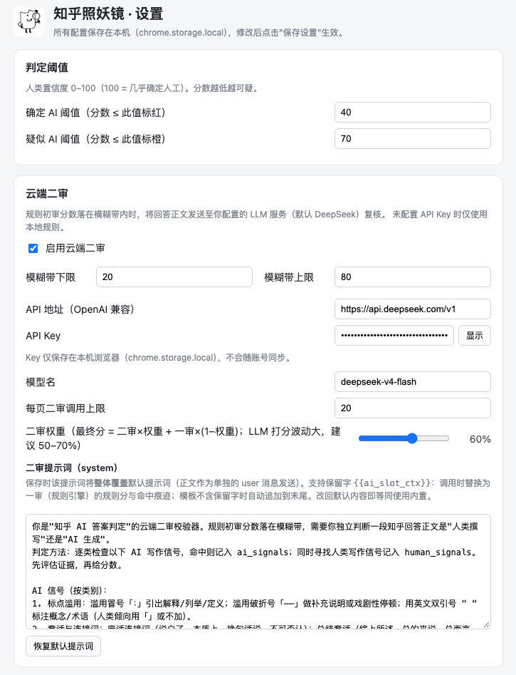

# 知乎照妖镜

在知乎问题页为每条回答打上「人类置信度」角标（0–100，100 = 几乎确定人工），一眼识别疑似 AI 生成的内容。默认**纯本地规则引擎**即时判定、零构建零依赖；拿不准的回答可选接入**你自己配置的 LLM** 做云端复核；判错了还能**一键覆盖**。与黑盒检测服务不同——每条判定都附命中痕迹与证据清单，理由可查、结果可改、数据只留在本机。

## 亮点

- **纯本地优先**：默认只跑规则引擎（21 类 AI 写作痕迹扣分：套话连接词、编号式结构、冒号/破折号滥用、英文双引号标注等），不发送任何内容
- **可解释**：点角标展开理由面板，命中痕迹逐条列出；二审还分「AI 倾向 / 人工倾向」两组证据，不是一句黑盒结论
- **可覆盖**：判定不满意一键「认为人工 / 认为 AI」，按回答 ID 持久化，刷新页面仍生效；优先级 **用户覆盖 > 云端二审 > 规则初审**
- **隐私可控**：API Key 只存在本机 `chrome.storage.local`，不同步不上传；正文仅在「启用二审 + 配置 Key + 分数落入模糊带 20–80」时才发送给你指定的服务商
- **轻量**：零构建零依赖，生产包约 52 KB；Manifest V3（Chrome ≥ 109），10 个经典脚本，无第三方依赖
- **可定制**：阈值、模糊带、字数下限（默认 300 字，更短跳过）、输入窗口、自定义正则规则（增删改）、二审提示词（`{{ai_slot_ctx}}` 保留字拼一审上下文）全部可在设置页调整

## 效果一览

| 正常判定 | 短回答跳过 | 疑似 AI（理由面板展开） |
|---|---|---|
|  |  |  |

设置页（阈值 / 模糊带 / API / 二审权重 / 提示词编辑 / 自定义规则）：



## 安装

1. 打开 `chrome://extensions`，右上角开启「开发者模式」
2. 点「加载已解压的扩展程序」，选择本目录（或解压 `dist/zhihu-zyj-0.1.0.zip` 后选择解压目录）
3. 打开任意知乎问题页（`zhihu.com/question/*`）即生效

> 扩展更新（重新加载）后，已打开的知乎页面里的旧内容脚本会失效（按钮无响应属正常），**刷新页面即可**。

## 快速使用

1. 每条回答上方自动出现角标（红 = 确定 AI / 橙 = 疑似 AI / 绿 = 正常 / 灰 = 跳过）
2. 点击角标展开理由面板：命中痕迹清单 + 二审证据 + 「认为人工 / 认为 AI / 重新判定」按钮
3. （可选）点击工具栏图标打开设置页，填入 API Key（OpenAI 兼容，默认 DeepSeek）并保存——首次保存会请求授权该 API 域名，授权后模糊判定的回答启用云端复核

## 工作原理

1. **发现**：`MutationObserver` 捕捉已渲染与滚动加载的回答卡片
2. **提取**：只取块级正文段落（默认 ≤2000 字，图/引用/图片占位跳过；连续两次采样一致才判定，避免 SPA 半渲染态干扰缓存哈希）
3. **初审**：21 类痕迹命中扣分 → 规则分 + 命中清单
4. **二审**（可选）：规则分落入模糊带时调用你配置的 LLM，按正文哈希缓存（LRU 500 条）、每页限 20 次、失败自动降级为规则分；二审分与规则分按权重（默认 0.6）融合，降低 LLM 打分波动

## 目录结构

```
manifest.json                  MV3 清单（权限/内容脚本/选项页）
src/
  shared/constants.js          默认配置 / 存储键 / 消息类型 / 二审提示词
  shared/storage.js            设置、覆盖、二审缓存的存储助手
  engine/traces.js             AI 创作痕迹清单（21 类，扣分制）
  engine/rules.js              规则引擎（评分 + 等级映射）
  content/extract.js           知乎 DOM 选择器与正文提取（单点维护）
  content/content.js           内容脚本主逻辑
  content/content.css          角标样式（zys- 前缀）
  cloud/second-opinion.js      云端二审（缓存/限流/调用/融合）
  background/service-worker.js SW：二审路由
  options/                     设置页（SPA，零构建）
icons/                         16/48/128 图标
docs/images/                   README 截图
```

## 限制

- 仅支持 `zhihu.com/question/*` 问题页回答列表
- 自定义 API 域名需为 https，保存时动态申请权限（拒绝则二审不可用）
- 规则引擎对文学性 / 古风文本有误报风险（二审提示词已显式规避，可调阈值）

## 开发

零构建项目：新增/修改 `src/` 下的脚本后，在 `chrome://extensions` 点刷新即可；`node --check` 可做语法校验。生产包 = `zip -r dist/zhihu-zyj-<版本>.zip manifest.json src icons`（`dist/` 已被 gitignore）。

- 领域词汇：`CONTEXT.md`
- 架构决策：`docs/adr/`（两级引擎、分数融合等）
- MVP / P2 规格与实现 ticket：`.scratch/mvp/`、`.scratch/p2/`
- 商店上架资料：`CHROMEWEBSTORE.md`
